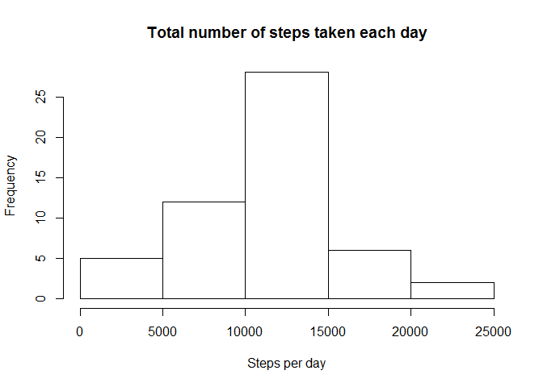
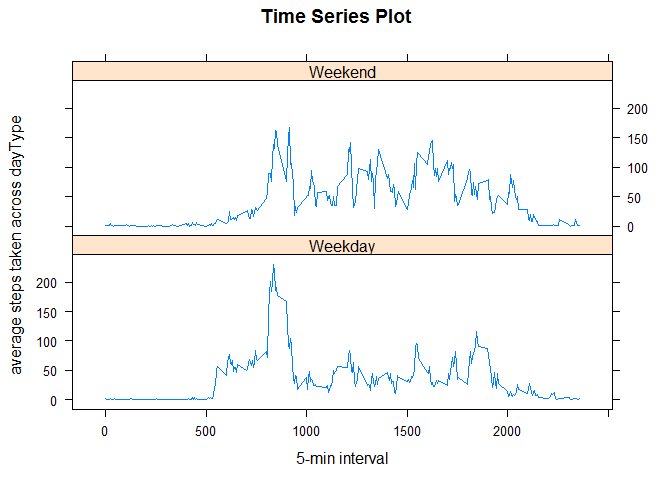

# Reproducible Research: Peer Assessment 1
================================================================================


## Loading and preprocessing the data

Unzip file and load the data

```r
unzip(zipfile = "activity.zip")
activity <- read.csv("activity.csv")
```
================================================================================

## What is mean total number of steps taken per day?
###1. Make a histogram of the total number of steps taken each day

```r
#Creates a dataframe containing the total steps taken for each date
totalStepsPerDay <- aggregate(data = activity,
                              steps ~ date,
                              FUN = sum,
                              na.omit = TRUE            
)
#Creates histogram required
hist(totalStepsPerDay$steps, 
     xlab = "Steps per day", 
     main = "Total number of steps taken each day"
     )
```

 

###2. Calculate and report the **mean** and **median** total number of steps taken per day


```r
meanTotalStepsPerDay = mean(totalStepsPerDay$steps)
medianTotalStepsPerDay = median(totalStepsPerDay$steps)
```

The mean of total number of steps taken per day is 1.0767189\times 10^{4}

The median of total number of steps taken per day is 10766

================================================================================

## What is the average daily activity pattern?

###1. Make a time series plot (i.e. `type = "l"`) of the 5-minute interval (x-axis) and the average number of steps taken, averaged across all days (y-axis)


```r
#Creates a dataframe containing the average steps for each 5min Interval
averageStepsPer5minInterval <- aggregate(data = activity,
                              steps ~ interval,
                              FUN = mean,
                              na.omit = TRUE            
)

#Make the required time series plot
library(lattice)
xyplot(steps ~ interval, 
       data = averageStepsPer5minInterval,
       type = "l",
       xlab = "5 min interval",
       ylab = "average steps taken across all days",
       main = "Time Series Plot"
       )
```

 

###2. Which 5-minute interval, on average across all the days in the dataset, contains the maximum number of steps?

```r
# maximum of the average
maxOfAverage <- averageStepsPer5minInterval[which.max(averageStepsPer5minInterval$steps),]$interval
```
The 5-minute interval, which on average across all the days in the dataset, contains the maximum number of steps is 835

================================================================================

## Imputing missing values

###1. Calculate and report the total number of missing values in the dataset (i.e. the total number of rows with NAs)

```r
totalNumRowsOfNAs <- sum(is.na(activity$steps))
```
The total number of missing values in the dataset is 2304.

###2. Devise a strategy for filling in all of the missing values in the dataset. The strategy does not need to be sophisticated. For example, you could use the mean/median for that day, or the mean for that 5-minute interval, etc.

Strategy: Since some days have no steps recorded at all, it would be more appropriate to fill the missing values with the mean for that particular 5-min interval. The mean of all the 5-min intervals have been computed earlier on and is stored in averageStepsPer5minInterval

###3. Create a new dataset that is equal to the original dataset but with the missing data filled in.

```r
#Duplicate the old dataset into new one
activityNew <- activity

#replace all missing values with the average of that particular 5-min interval
for (i in 1:nrow(activityNew)){
    
    if(is.na(activityNew[i,1])){
        for (j in 1:nrow(averageStepsPer5minInterval)){
            if(activityNew[i,3] == averageStepsPer5minInterval[j,1]){
                activityNew[i,1] <- averageStepsPer5minInterval[j,2]
            }
        }
    }
}
```

###4.Make a histogram of the total number of steps taken each day and Calculate and report the mean and median total number of steps taken per day. Do these values differ from the estimates from the first part of the assignment? What is the impact of imputing missing data on the estimates of the total daily number of steps?

#### Make the required histogram

```r
#Creates a dataframe containing the New total steps taken for each date
totalStepsPerDayNew <- aggregate(data = activityNew,
                              steps ~ date,
                              FUN = sum
)
#Creates histogram required
hist(totalStepsPerDayNew$steps, 
     xlab = "Steps per day", 
     main = "New Total number of steps taken each day"
     )
```

 

#### Calculate and report the new mean and median

```r
meanTotalStepsPerDayNew = mean(totalStepsPerDayNew$steps)
medianTotalStepsPerDayNew = median(totalStepsPerDayNew$steps)
```
The mean of total number of steps taken per day is 1.0766189\times 10^{4}

The median of total number of steps taken per day is 1.0766189\times 10^{4}

Impact: The frequency of the steps per day increases in the histogram as expected. The mean and median also slightly increases.

## Are there differences in activity patterns between weekdays and weekends?

###1. Create a new factor variable in the dataset with two levels - "weekday" and "weekend" indicating whether a given date is a weekday or weekend day.


```r
#Add a new variable to the dataset
activityNew$dayType <- weekdays(as.Date(activityNew$date))

#Replace Saturday and Sunday with Weekend and the rest with Weekday
for (i in 1:nrow(activityNew)){
    
    if(activityNew[i,4] == "Saturday" || activityNew[i,4] == "Sunday"){
        activityNew[i,4] <- "Weekend"
    }
    else{
        activityNew[i,4] <- "Weekday"    
    }     
}
```

###2. Make a panel plot containing a time series plot (i.e. type = "l") of the 5-minute interval (x-axis) and the average number of steps taken, averaged across all weekday days or weekend days (y-axis). See the README file in the GitHub repository to see an example of what this plot should look like using simulated data.


```r
averageStepsPer5minIntervalPerDayType <- aggregate(data = activityNew,
                                         steps ~ dayType + interval,
                                         FUN = mean         
                                        )

xyplot(steps ~ interval | dayType, 
       data = averageStepsPer5minIntervalPerDayType,
       type = "l",
       xlab = "5-min interval",
       ylab = "average steps taken across dayType",
       main = "Time Series Plot",
       layout = c(1,2)
) 
```

 
